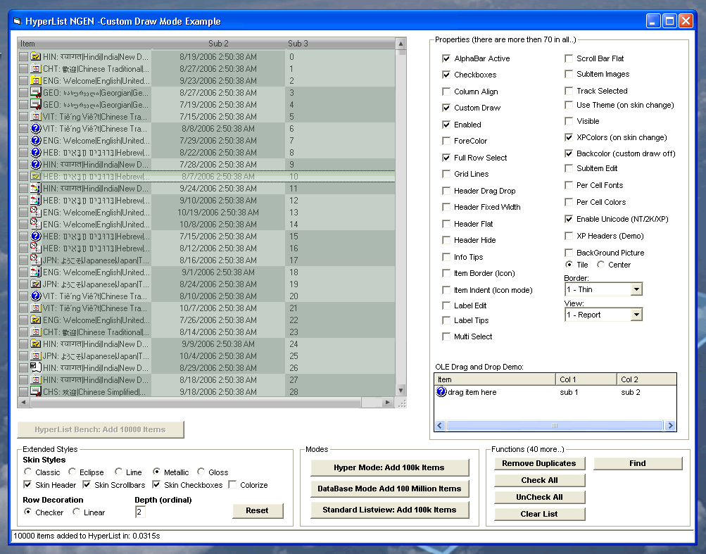



## Final 2\.4\.6\- HyperList NGEN\! The last Listview control you will ever need\.\.

### Description

Updated the Find routine as requested, also updated a couple skinheader routines. This will be the last update..

Bugfixes and Additions to 2.4.4-

Fixed subitem edit scroll, mousewheel support, alphabar reset. Extended example with xp skinned header, row drop in list.

Bugfixes and Additions to 2.4.3-

Added column drag insertion marks. Changed checkboxes from ownerdrawn to state image list. Many small bugfixes..

Bugfixes to 2.4.2-

A lot of fixes and rewrites, cleaned up all the classes, fixed various feature issues. Added an internal access demo.

Bugfixes to 2.4-

Crash on some foreign language versions of xp resolved. Edit box placement issue, bg image overpaints and other misc fixes are in.

Ver 2.4 Is Up!

Fixes are in, added a find function and right align text property.

Barring any future bugfixes this will be the last version.

----

Ver. 2.3 Is Up!

Unicode on demand. Unicode support has been completely restructured to provide ansi only support (98/ME), and unicode when required.

Skinned checkboxes added to other views. XP style class added, with header themed in-class. Cell level fonts and colors added. Top down rewrite of skinning classes, with skinned header text alignment added. Many bugfixes and major changes to this revision.

----

Ver. 2.2 Is Up!

The best listview on the block, just got better..

Added full ole drag and drop support. Subitem editing. Background images, and a ton of other features..

Many bug fixes and optimizations made, take a look..

Hyperlist NGEN Ver 1.1

----

The fastest, most featured, most powerful listview in this language!

Three data access modes, Virtual, Custom Draw, and Hyper Mode. All of them unbelievably fast. Built in storage and sorting in a virtual listview hybrid.

Skinned Headers/Scrollbars/Checkboxes and Selector Bar. User definable skin color schemes, theming, row decoration, per cell font and color formatting, and hundreds of properties and functions.

Hope ya like it..
 
### More Info
 

             |
---                |---
**Submitted On**   |2007-01-03 20:44:22
**By**             |[Steppenwolfe](https://github.com/Planet-Source-Code/PSCIndex/blob/master/ByAuthor/steppenwolfe.md)
**Level**          |Intermediate
**User Rating**    |4.9 (381 globes from 77 users)
**Compatibility**  |VB 6\.0
**Category**       |[Complete Applications](https://github.com/Planet-Source-Code/PSCIndex/blob/master/ByCategory/complete-applications__1-27.md)
**World**          |[Visual Basic](https://github.com/Planet-Source-Code/PSCIndex/blob/master/ByWorld/visual-basic.md)
**Archive File**   |[Final\_2\_4\_204076132007\.zip](https://github.com/Planet-Source-Code/steppenwolfe-final-2-4-6-hyperlist-ngen-the-last-listview-control-you-will-ever-need__1-66732/archive/master.zip)

